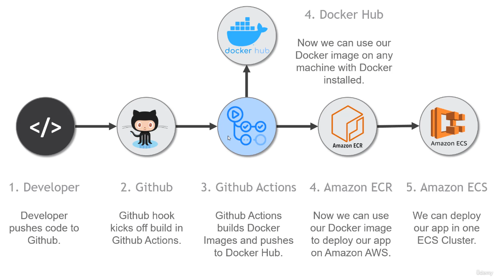
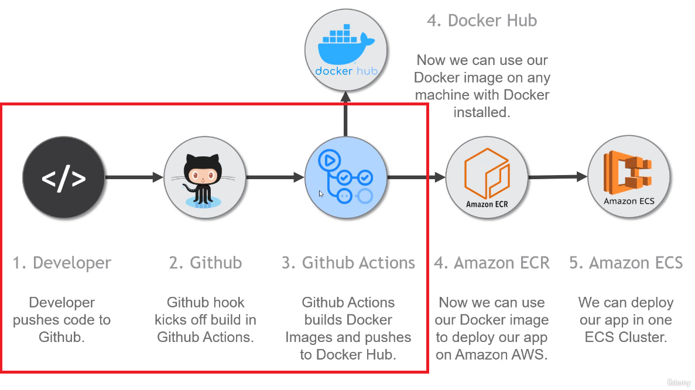

# Java com JUnit 5, Mockito, Spring, Github Actions, CI/CD e outras ferramentas

## Sumário

- [O que é Continuous Integration (CI) e Continuous Delivery (CD) (Integração contínua e Entrega contínua)](#o-que-é-continuous-integration-ci-e-continuous-delivery-cd-integração-contínua-e-entrega-contínua)
  - [O que é Continuous Integration (CI)](#o-que-é-continuous-integration-ci)
  - [O que é Continuous Delivery (CD)](#o-que-é-continuous-delivery-cd)
  - [Benefícios de se utilizar CI/CD](#benefícios-de-se-utilizar-cicd)
  - [Observação sobre CI/CD](#observação-sobre-cicd)
- [Componentes de uma infraestrutura CI/CD](#componentes-de-uma-infraestrutura-cicd)
- [Ferramentas comuns para CI/CD](#ferramentas-comuns-para-cicd)

## O que é Continuous Integration (CI) e Continuous Delivery (CD) (Integração contínua e Entrega contínua)

- São metodologias que auxiliam as equipes de Devops, melhorando o ciclo de desenvolvimento.
- É possível resolver problemas causados pela integração de novos códigos e aumentar a frequência na entrega de novas funcionalidades
- Automatizar o processo de desenvolvimento de software, tornado-o mais seguro para entregas frequentes.
  

### O que é Continuous Integration (CI)

- Processos para realizar testes automatizados sempre que o código é enviado para o repositório
- Em teoria todos os módulos do fonte deverão ser testados, caso haja erros na execução dos testes, a CI ajuda a encontra-los e corrigi-los mais rápido.
- Garante que o códigoZ
- Evitar conflitos entre branchs.
- Podemos entender CI como sendo os testes que serão feitos de forma automática pelo Github Actions ao commit chegar no repositório para garantir a integridade do projeto e também é possível ainda em CI automatizar o merge também com Github Actions.
  

### O que é Continuous Delivery (CD)

- Depois da integração, as alterações feitas no código passam pela CD.
- É possível garantir segurança e integridade por causa das automação realizadas pelo CI, desta forma é possível fazer entregas contínuas de novas features.
- A CD direciona em que branch deverá ser feito o merge das alterações realizadas.
- CD também pode ser referir a Implantação Contínua, ou seja, o deploy automático para algum ambiente.

### Benefícios de se utilizar CI/CD

- É possível identificar erros no início do ciclo de vida do software.
- Agilidade
- Compartilhamento da visão (Os testes podem ser vistos por qualquer pessoa)
- É possível garantir segurança, uma vez que os testes irão barrar as alterações caso falhe em algum teste.

### Observação sobre CI/CD

- Existe CI sem CD, mas CD sem CI não existe.
- A CD só funciona se a CI for implementada corretamente.

## Componentes de uma infraestrutura CI/CD

- Envolve diversos componentes que trabalham em conjunto para automatizar o processo de desenvolvimento e entrega de software como:
  - Controle de versão (Git/Github)
  - Servidor de build (Jenkins/Github Actions)
  - Ambientes de testes (Ambiente isolado onde os artefatos são implantados para realizar teste automatizados.)
  - Ferramentas de automação de testes (JUnit, Mockito, Selenium, Postman...)
  - Ferramentas de implantação (Deploy em ambiente de testes ou deploy em produção. Kubernetes)
  - Orquestração de pipelines (Azure Devops, Github Action, Jenkins...)
  - Monitoramente e Logging (Acompanhar informações de projetos em produção. Amazon ECS)
  - Infraestrutura como código (É possível utilizar o CI/CD como código. Amazon AWS CloudFormation)

## Ferramentas comuns para CI/CD

- Git (Versionamente de código)
- Github Action (Automatização de tarefas e muitas coisas)
- Jenkins (Automatização de tarefas e muitas coisas)
- Docker (Plataforma de conteinerização)
- Kubernetes (Orquestração de conteiners)

## Como implementar um pipeline CI/CD?

- Alinhar os processos
- Buscar entender quais são os elementos de um pipeline de CI/CD
  - Compilação
  - Teste automatizados
  - (Opcional) Testes manuais
  - Push
  - Implantação
  - Validação
- Limpar os ambientes entre uma implantação e outra
- Monitorar o pipeline
- Cultura de Devops

## JUnit 5

- Dependencias para o JUnit 5

```xml
	<dependencies>
		<dependency>
			<groupId>org.junit.jupiter</groupId>
			<artifactId>junit-jupiter-api</artifactId>
			<version>5.10.2</version>
			<scope>test</scope>
		</dependency>
		<dependency>
			<groupId>org.junit.jupiter</groupId>
			<artifactId>junit-jupiter-engine</artifactId>
			<version>5.10.2</version>
			<scope>test</scope>
		</dependency>
		<dependency>
			<groupId>org.junit.jupiter</groupId>
			<artifactId>junit-jupiter-params</artifactId>
			<version>5.10.2</version>
			<scope>test</scope>
		</dependency>
	</dependencies>
```

- Ou podemos utilizar o Aggregator para não termos que lidar com muitas dependencias

```xml
	<dependencies>
		<!-- https://mvnrepository.com/artifact/org.junit.jupiter/junit-jupiter -->
		<dependency>
			<groupId>org.junit.jupiter</groupId>
			<artifactId>junit-jupiter</artifactId>
			<version>5.10.2</version>
			<scope>test</scope>
		</dependency>
	</dependencies>
```

- Comando para gerar o package do maven, pulando os testes: `mvn package -Dmaven.test.skip=true`

## Mockito

- Nos testes, temos duas formas de simular dados, utilizandos Stubs e utilizando o Mockito.

### Por que não utilizar Stubs?

- Quando estamos falando de stubs, estamos nos referindo a implementações exclusivas para testes, que irão voltar dados pré-estabelecidos, um grande problema disso é quando precisamos alterar as interfaces (ou contratos), essa alteração irá quebrar todo o stub, tendo a necessidade de revisar manualmente as classes.
- Isso em larga escala, em um ambiente com vários programadores, torna-se muito complexo a manutenção e usabilidade, uma vez que não necessariamente todos os métodos serão utilizados.

- Interface

```java
public interface CourseService {

	public List<String> retriveCourses(String student);

	public List<String> doSomething(String student); // Método adicionado

}
```

- Stub (Perceba que aqui, estamos somente com um método implementado, logo está classe
  estará dando erro, tendo necessidade de ser revisada manualmente)

```java
public class CourseServiceStub implements CourseService {

	@Override
	public List<String> retriveCourses(String student) {
		return Arrays.asList("REST API's RESTFul do 0 à Azure com ASP.NET Core 5 e Docker",
				"Agile Desmistificado com Scrum, XP, Kanban e Trello", "Spotify Engineering Culture Desmistificado",
				"REST API's RESTFul do 0 à AWS com Spring Boot 3 Java e Docker",
				"Docker do Zero à Maestria - Contêinerização Desmistificada",
				"Docker para Amazon AWS Implante Apps Java e .NET com Travis CI",
				"Microsserviços do 0 com Spring Cloud, Spring Boot e Docker",
				"Arquitetura de Microsserviços do 0 com ASP.NET, .NET 6 e C#",
				"REST API's RESTFul do 0 à AWS com Spring Boot 3 Kotlin e Docker",
				"Kotlin para DEV's Java: Aprenda a Linguagem Padrão do Android",
				"Microsserviços do 0 com Spring Cloud, Kotlin e Docker");
	}

}
```

- Classe de teste

```java
class CourseBusinessStubTest {

	@Test
	void testCoursesRelatedToSpring_When_UsingAsStub() {

		// Given / Arrange
		CourseService stubService = new CourseServiceStub();
		CourseBusiness business = new CourseBusiness(stubService);

		// When / Act
		var filteredCourses = business.retriveCoursesRelatedToSpring("Matheus");

		// Then / Assert
		assertEquals(4, filteredCourses.size());
	}

	@Test
	void testCoursesRelatedToSpring_When_UsingAFooBarStudent() {

		// Given / Arrange
		CourseService stubService = new CourseServiceStub();
		CourseBusiness business = new CourseBusiness(stubService);

		// When / Act
		var filteredCourses = business.retriveCoursesRelatedToSpring("Foo Bar");

		// Then / Assert
		assertEquals(0, filteredCourses.size());
	}

}

```

- Logo, torna-se inviavel a cada alteração na interface ter que revisar os Stubs.

### Como utilizar o Mockito?

- Ao trabalhar com o Mockito, não estaremos trabalhando com a classe real, estaremos trabalhando com uma classe semelhante a real. Desta forma por exemplo uma classe que buscaria uma lista no banco de dados, o Mockito irá interceptar essa chamadas e voltar uma lista pré-definida, evitando conexões de teste.
- Essencialmente diferente dos Stubs, o Mockito permite criarmos/simular dados em runtime. Para chamar um "Mock" ao invés de passarmos a instância direta, podemos fazer desta forma:

```java
class CourseBusinessMockTest {

	CourseService mockService;
	CourseBusiness business;

	@BeforeEach
	void setup() {
		// Given / Arrange
		mockService = mock(CourseService.class); // Aqui o Mockito, fará a injeção de um Mock automático
		business = new CourseBusiness(mockService);
	}

	@Test
	void testCoursesRelatedToSpring_When_UsingAMock() {

		// When / Act
		var filteredCourses = business.retriveCoursesRelatedToSpring("Matheus");

		// Then / Assert
		assertEquals(4, filteredCourses.size());
	}

}

```

- Para interceptar o método e retorna valores pré-definidos, podemos fazer da seguinte forma:

```java
class CourseBusinessMockTest {

	CourseService mockService;
	CourseBusiness business;
	List<String> courses;

	@BeforeEach
	void setup() {
		// Given / Arrange
		mockService = mock(CourseService.class);
		business = new CourseBusiness(mockService);
		courses = Arrays.asList("REST API's RESTFul do 0 à Azure com ASP.NET Core 5 e Docker",
				"Agile Desmistificado com Scrum, XP, Kanban e Trello", "Spotify Engineering Culture Desmistificado",
				"REST API's RESTFul do 0 à AWS com Spring Boot 3 Java e Docker",
				"Docker do Zero à Maestria - Contêinerização Desmistificada",
				"Docker para Amazon AWS Implante Apps Java e .NET com Travis CI",
				"Microsserviços do 0 com Spring Cloud, Spring Boot e Docker",
				"Arquitetura de Microsserviços do 0 com ASP.NET, .NET 6 e C#",
				"REST API's RESTFul do 0 à AWS com Spring Boot 3 Kotlin e Docker",
				"Kotlin para DEV's Java: Aprenda a Linguagem Padrão do Android",
				"Microsserviços do 0 com Spring Cloud, Kotlin e Docker");
	}

	@Test
	void testCoursesRelatedToSpring_When_UsingAMock() {

		// Given / Arrange
		when(mockService.retriveCourses("Matheus")).thenReturn(courses);

		// When / Act
		var filteredCourses = business.retriveCoursesRelatedToSpring("Matheus");

		// Then / Assert
		assertEquals(4, filteredCourses.size());
	}

}
```

- Explicação: Ao utilizar o método _when_ do Mockito, deixamos o mockito interceptar essa chamada de método e retornar um valor especifíco, desta forma podemos alterar quantas vezes for necessário a interface, que não irá interferir nos testes.
- Classe Business

```java
// SUT - System (Method) Under Test
public class CourseBusiness {

	// CourseService is a Dependecy
	private CourseService service;

	public CourseBusiness(CourseService service) {
		this.service = service;
	}

	public List<String> retriveCoursesRelatedToSpring(String student) {

		var filteredCourses = new ArrayList<String>();
		if ("Foo Bar".equals(student))
			return filteredCourses;
		var allCourses = service.retriveCourses(student);

		for (String course : allCourses) {
			if (course.contains("Spring"))
				filteredCourses.add(course);
		}

		return filteredCourses;
	}

}
```
